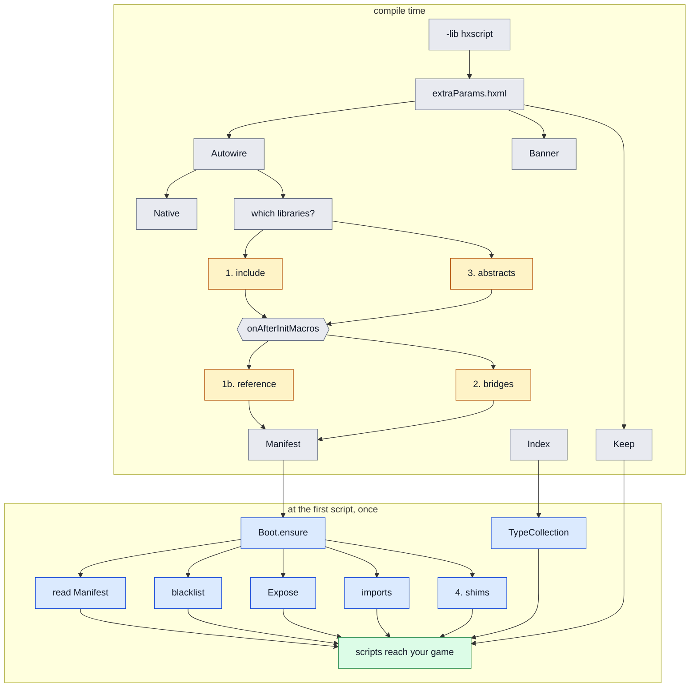
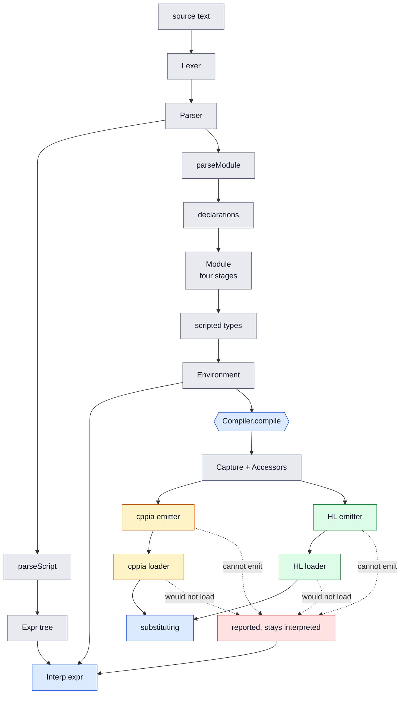

# How hxScript works

# Introduction

This project started as a fork of hscript-insanity, which is itself a fork of hscript, with some of
its own to-do list ticked off and one preference of my own added: forced typing, because that is what
I am used to.

Then I had an idea. I wanted to see whether the interpreter could be made faster, because it was
quite slow compared to hscript and the other hscript forks. I also wanted it to extend compiled
classes directly, without having to fill my project with dummy classes and maps to bridge the two.

So I got to work, and there was a lot to improve. Much of the slowness came from how much
functionality had been added to the interpreter over time. After hours of testing, with Claude
running tests autonomously alongside me, I ended up with an interpreter that is both extremely
feature rich and close to Haxe's own syntax, and that generally performs near, equal to, or in some
cases better than what it came from.

I was happy with that, but I could not stop thinking: what if it could work like LuaJIT? I went
looking, and found that hxcpp does have a cppia backend with JIT support. Nothing used it at run time
though, and it looked like it needed the Haxe toolkit installed, which defeats the point. So I set
the idea aside.

Then one night I could not sleep, and I started thinking about the cppia JIT backend again. That is
when it clicked: what if I did what hscript does, but emitted cppia bytecode directly instead?

I got out of bed, tested the theory with a small case, and it worked. The next day I think I coded
for close to twenty hours straight, broken up by coffee, the toilet breaks that follow from it, and
some snacks.

Later the same question came back wearing different clothes: HashLink has bytecode of its own and a
jit that is genuinely good, and a great many Haxe games ship on it. That one turned out to be a
harder problem than cppia rather than the same problem again, for reasons that are the whole of part
three.

That is how we got here.

What follows is the full technical side of the implementation: the interpreter that defines what an
answer should be, then the two backends that try to produce the same answer faster.

Two diagrams first, because both pipelines are easier to hold in one picture than in ten pages of
prose: how the library gets itself into your game, and what happens to a script once it is there.

# Part zero: how the library reaches your game

`-lib hxscript` is the whole of the setup, and what that one line buys is four things a script needs
before it can touch the game around it. All four happen without appearing in your build file, which
is convenient and also the reason this diagram exists: a step that runs on its own is a step nobody
watches.

<details>
<summary><b>Diagram: from -lib hxscript to a script that can reach your game</b></summary>



</details>

The amber boxes are the four steps [advanced.md](advanced.md#4-adding-a-game-library) describes, and
they are numbered because each one fails differently:

| step | what it does | symptom when it is missing |
| --- | --- | --- |
| **1** `include` | force-compiles the packages, so the types exist to be found | `Type not found` |
| **1b** `reference` | pulls in `Library.types` by naming them, for a package that cannot be included | `Type not found` |
| **2** `Bridges` | one bridge class per scriptable base | `Class <base> can't be extended for scripting` |
| **3** `Abstracts` | a reflectable wrapper per native abstract | `Unknown identifier: ADD` |
| **4** `Shims` | closures for members with no runtime form, into `Config.callShims` | `Cannot call null` |

The grey boxes are plumbing rather than steps. `Keep` forces the standard-library types scripts reach
by reflection into the build and marks them `@:keep`. `Native` builds `hxscript.hdll` and is
HashLink's alone; it cannot fail a build. `Banner` prints what was wired and which backend you got.
`Index` records a `TypeInfo` per type in the build and serialises it into `TypeCollection.main`, which
is what lets a script name `haxe.Json` with nothing registered by hand. `which libraries?` is
`Presets.active` plus `hostLibrary`: `-lib flixel` switches the flixel record on, and
`-D hxscript_host` scans your own source for `@:scriptable` and `@:scriptAmbient`.

Two things in that picture are load-bearing and neither is obvious.

**The two halves read the same answer rather than deriving it twice.** `Autowire` bakes what it
actually wired into `hxscript.wired.Manifest`, and `Boot` reads that, so a `Presets.custom` record
the build acted on cannot be one the startup forgot about.

**Nothing calls `Boot.ensure`.** `Environment`, `Module` and `Script` each call it before they do
anything else and it returns on its first line the second time, so the runtime half is in place
before the first interpreter exists whichever of the three a host reaches for first. That ordering
is why [advanced.md](advanced.md#order-of-operations) is a page about sequence: a module builds its
interpreter in its constructor, and anything a host adds to `Config` afterwards is too late for the
modules already made.

# From source text to an answer

Everything below this line is one of these three branches, drawn out. The front end is shared: there
is one lexer, one parser and one tree, and the backends compile the same tree the interpreter walks,
which is what makes "does it answer the same thing" a question you can ask at all.

<details>
<summary><b>Diagram: one tree, three ways to run it</b></summary>



</details>

**`Interp.expr` is in the middle on purpose.** It is not a fallback, it is the definition: the
conformance corpus asks every column what a construct answers and compares each compiled one against
its own target's interpreter, which is why [`support-table.md`](support-table.md) can say the two
agree rather than that the tests passed.

**The two shared passes cannot refuse.** `compile/Capture` boxes a local a closure both captures and
assigns; `compile/Accessors` turns a local property into the `get_x()` and `set_x(v)` calls it stands
for. Both are pure rewrites, both run over a body before a token is written, and `Accessors` has to
run first, which was learned the hard way and is [part two](#where-the-tree-has-to-be-rewritten-first).

**The dashed edges are the whole safety argument.** A refusal costs speed and never behaviour, and the
two kinds are kept apart in the report because they have different fixes: `report.skipped` is an
emitter declining to emit, `report.failed` is a loader declining to accept what was emitted. Each
carries a name, a reason and a position.

Where the two backends differ, in one table. Everything else about them is the same shape:

| | cppia | HashLink |
| --- | --- | --- |
| bytecode | text, token stream with pools | binary, variable-length signed ints |
| operands | a stack | typed registers, allocated per function |
| loaded by | `cpp.cppia.Module.fromData` | the carried loader, through `hxscript.hdll` |
| offered | in batches, so modules may refer to each other | one module at a time |
| a rejected load | the batch is halved and retried | reported, and that module is interpreted |
| the JIT | opt-in, process-wide, one call at startup | the VM jits whatever it loads |

# Part one: the interpreter

The compiler is not a separate language. It compiles the same syntax tree the interpreter walks, and
it is judged against what the interpreter answers. So the interpreter is the thing to understand
first: it defines the semantics, and everything the compiler does is an attempt to produce the same
answer faster.

## The pipeline

Source text becomes an answer in three steps.

```
source  ->  Lexer  ->  Parser  ->  Expr tree  ->  Interp.expr()  ->  value
```

`hxscript.syntax.Lexer` turns characters into tokens. `hxscript.syntax.Parser` turns tokens into a
tree. There are two entry points, and the difference matters later:

* `parseScript` reads a bare body, the kind of thing you write in a text file with no `class` around
  it.
* `parseModule` reads a whole module: a package, imports, `using`, and type declarations.

Nothing is type checked at this point. The parser records the types it was given, but it does not
resolve them or verify them, which is why a script naming a type that does not exist parses fine and
fails when it runs.

## The tree

`hxscript.syntax.Expr` defines two enums. `ExprDef` is the expression forms, and every node in the
tree is wrapped as `{e: ExprDef, pos: Position}` so errors can point at a line. The forms are close
to Haxe's own: `EConst`, `EIdent`, `EVar`, `EBlock`, `EField`, `EBinop`, `EUnop`, `ECall`, `EIf`,
`EWhile`, `EFor`, `EForGen`, `EFunction`, `EReturn`, `EArray`, `EArrayDecl`, `ENew`, `EThrow`,
`ETry`, `EObject`, `ETernary`, `ESwitch`, `EDoWhile`, `EMeta`, `ECheckType`, `ECast`, `EImport`,
`EUsing`.

`ModuleDecl` is the declaration forms: `DPackage`, `DImport`, `DUsing`, `DField`, `DClass`,
`DInterface`, `DEnum`, `DTypedef`, `DAbstract`.

Two details are worth noticing now, because the compiler has to reproduce both.

`EVar` carries more than a name and a type: `EVar(n, t, e, get, set, isFinal)`. A local can be
declared with property accessors, which is not something Haxe allows, and it can be `final`.

`EField` carries a `maybe` flag, which is the safe navigation operator, and `ETry` carries a list of
extra catches beyond the first.

## Walking the tree

`hxscript.runtime.Interp` is the evaluator, and `expr()` is the whole of it: a switch over `ExprDef`
that returns a `Dynamic`. Evaluating `a + b` means evaluating `a`, evaluating `b`, and applying the
operator, all as method calls on the interpreter, every time the line runs.

That is the cost model in one sentence. There is no preparation step that turns the tree into
something cheaper to run, so a loop body of ten nodes is ten switch dispatches per iteration, plus a
map lookup for every name, plus boxing for every value, because everything is `Dynamic`.

The interpreter keeps a small amount of state alongside the tree:

| field | what it holds |
| --- | --- |
| `variables` | globals the host injected, and module level names |
| `imports` | what `import` brought into scope |
| `usings` | the types a `using` put in scope, in declaration order |
| `locals` | the current scope's named slots |
| `parent` | a host object whose fields resolve as bare names |
| `environment` | the world of modules and types this interpreter resolves against |
| `stack` | the script level call stack, for error reporting |

## Names and scopes

A local is a `hxscript.runtime.Variable`, not a bare value:

```haxe
class Variable {
    public var ref:Dynamic;            // the value, when it is not a number
    public var num:Float = 0;          // the value, when it is
    public var lane:Int = REFERENCE;   // which of the two holds it
    public var r(get, set):Dynamic;    // the value, whichever lane it is in

    public var a:AbstractValue = null; // the abstract wrapper, when it is one
    public var t:CType = null;         // the declared type
    public var isFinal:Bool = false;
    public var access:Array<FieldAccess> = null;
    public var get:String = null;      // property accessors, for a local
    public var set:String = null;
}
```

That is why reading a local is not a map lookup and nothing more. `readLocal` consults `get` and may
call a `get_x` function; `writeLocal` consults `set`, refuses to assign to a `final`, and refuses to
rebind a method that was not declared `dynamic`. Both honour `@:bypassAccessor`.

**The two lanes are the one place the tree walk escapes `Dynamic`.** On a target where a `Dynamic` is
a pointer, every write of an `Int` to a slot allocates a box, and a loop counter is written once per
iteration. So a number lives in `num` with `lane` saying which kind it is, and `setInt`, `setFloat`,
`asInt` and `asFloat` read and write it without boxing on the way. `r` is a property that boxes only
when somebody actually asks for a `Dynamic`, so nothing holding a `Variable` has to know which lane
it is in. Construction is `{ref: value}`, not `{r: value}`, because `r` has no storage of its own.

Scopes are handled by save and restore rather than by a stack of maps. Entering a block records how
many names have been declared so far; declaring a name pushes the previous binding onto
`declaredOld`; leaving the block puts the previous bindings back. One map, restored on the way out.

Resolving a bare name has a fixed order, and each step is a lookup that fails through to the next:

1. `captures`, if the current closure captured anything
2. `locals`
3. `imports`
4. `variables`
5. `parent`, when the interpreter is bound to a host object

If none of them answer, it is an error, and the error carries the position from the node.

## Control flow

`break`, `continue` and `return` are flags on the interpreter rather than exceptions:
`breaking`, `continuing`, `returning`, with `unwinding` being true when any of them is set. Loops and
blocks test `unwinding` between statements and stop early.

Exceptions thrown by scripts are real Haxe exceptions, and `ETry` catches them, matching against the
declared catch type and falling through to the extra catches.

## Functions and closures

`EFunction` builds a closure. Because locals live in one map that is restored on scope exit, a
closure cannot simply keep a reference to that map: it has to capture what it needs at the point it
is created. That is what `captures` is, and it is why the identifier lookup checks captures first.

## Classes and the world

`parseModule` gives declarations, not values. `hxscript.Module` holds a module's declarations and
brings them to life in stages: `parse`, then `init`, then `start`, then `startTypes`.

A scripted class becomes a `hxscript.types.ScriptedClass`. Each instance carries its own interpreter,
which is the mechanism behind a few behaviours that look surprising until you know that, including
the way a property declared `(null, null)` is readable only from the instance that owns it.

`hxscript.Environment` is the world those modules live in: which modules exist, which types they
declare, and what a name resolves to.

## Reaching the host

A script is not much use if it cannot touch the program hosting it, and this is the part the fork was
started for.

Compiled types are indexed at compile time. `hxscript.macro.Index` records a `TypeInfo` for every
type in the build and serialises it, and `hxscript.types.TypeCollection` rebuilds that into a lookup
at run time. So a script naming `haxe.Json` finds it without the host having registered anything by
hand.

`Std`, `Type`, `Reflect` and friends are proxied rather than used directly, in
`hxscript.proxy.TypeProxy` and its neighbours, because `Type.getClass` of a scripted instance has to
answer with the scripted class rather than with `ScriptedClass`. Inside the interpreter, `Type` means
the proxy and `HaxeType` means the real one, which is a distinction worth remembering when reading
that file.

Two smaller mechanisms round it out. `parent` binds an interpreter to a host object so its fields and
methods resolve as bare names, and `usings` implements static extensions, resolved against the
receiver's value at the point of the call rather than against a written type.

## Where the time goes

Everything above is a cost that repeats on every evaluation:

* a switch dispatch per node, per execution
* a map lookup per name
* `Dynamic` almost everywhere, so dynamic dispatch on arithmetic, and boxing wherever a value leaves
  a `Variable`'s numeric lane
* a `Variable` indirection on every local read and write
* position tracking and a script level call stack maintained as it goes
* host calls going through reflection

None of these are wrong, and a good deal of the work in this fork was making each of them cheaper.
But they are inherent to walking a tree, and no amount of tuning removes the tree walk itself.

That is the observation the rest of this document is about. The tree is walked the same way every
time, so the decisions made during the walk could be made once, ahead of time, and written down in a
form the machine can run directly.

The next part covers what cppia is, why it turned out to be reachable at run time, and how the
emitter turns the tree above into bytecode that answers the same way.

# Part two: compiling to cppia

## What cppia is

cppia is hxcpp's scriptable bytecode. Haxe can already target it: `haxe -m Script --cppia out.cppia`
produces a module that a compiled hxcpp program can load and run, so a program can be extended
without being rebuilt.

Two properties of it are what this whole idea rests on.

**It is text.** A cppia module is a header, a pool of strings, a pool of type names, and then class
records made of whitespace separated tokens. Here is a whole one, for a class with a single method
that returns `a * b`:

```
CPPIA
5
0
3 run
1 a
1 b
6 Script
2
0
6 Script
1
CLASS 1 0 0 1
FUNCTION 1 0 1 0 0 5 RETVAL 5 0 5 * 0 5 VAR 1 0 5 VAR 2
NOMAIN
RESOURCES 0
```

**Nothing about producing it requires a compiler.** Building that is string concatenation. There is
no Haxe toolkit involved, no process to spawn, no temporary files. If you can work out which tokens
mean what, you can write them from inside a running program.

That is the part that had stopped me earlier. I had assumed reaching cppia meant shelling out to
`haxe`, which would rule it out for a shipped application. It does not. The toolkit is needed to
compile the *host*, once, the way any Haxe program is compiled. It is not needed to produce a module
at run time.

## What the host needs

The host needs `-D scriptable`, which emits the scriptable interface that lets a module loaded later
find host classes by name. That one is not optional.

Dead code elimination is worth understanding but is the host author's choice. A script reaches
library types by name, so DCE has every reason to strip members nothing in the host itself touches,
and a script that reached one of them would fail at run time. `hxscript.macro.Keep` is the answer to
that: `-lib hxscript` applies it, and it forces the members a script is likely to reach to survive
under the default `-dce std`. Turning DCE off entirely is one blunt way to get the same guarantee,
and it is what parts of this repository's own test suite do, but it is not a requirement and it costs
binary size.

Loading is three calls:

```haxe
var loaded = cpp.cppia.Module.fromData(bytes.getData());
loaded.boot();
var cls = loaded.resolveClass('p.T');
```

and the JIT is one more, `cpp.cppia.Host.enableJit(true)`, which has to happen before the module
boots because compilation runs over the whole module at boot.

## The emitter

`hxscript.cppia.Emitter` walks the same `Expr` tree the interpreter walks. Where the interpreter
would compute a value, the emitter writes the tokens that compute it later.
`hxscript.cppia.Writer` owns the pools and the output, handing out string and type ids and assembling
the final module.

The mapping is mostly direct. `EIf` becomes `IFELSE`, `EBlock` becomes `BLOCK`, a local read becomes
`VAR` and a slot number, a field read becomes `FLINK` or `FTHISNAME` depending on whether the field's
class is known. Where it stops being direct is the interesting part, and there are three kinds of
place where it does.

### Where the tree has to be rewritten first

Two passes run over a function body before a token is written, both in `hxscript.compile`.

`Capture` boxes any local that a closure both captures and assigns into a one element array, because
cppia closures cannot share a stack slot. It also rewrites a named local function into a variable and
an assignment, which strips the name off the function.

`Accessors` turns a local declared with property accessors into the calls it stands for, rewriting
reads into `get_x()` and writes into `set_x(v)`.

The order matters and was learned the hard way. `Accessors` has to run first: an accessor that names
its own property captures it, so by the time `Capture` has run there is no identifier left to
rewrite, only an array index. That is why this lives in a tree pass rather than in the emitter, which
is where the first attempt put it.

### Where cppia has no spelling for something

Some constructs have no bytecode form. The emitter throws `Unsupported`, and the module is left
interpreted rather than compiled.

That is safe, but it is not free: a refusal costs the whole module its compiled form, over one
expression that may never run. So `Backend.batch` does not give up on a rejected group. It splits the
batch in half and tries each half, down to single modules, so one refusal costs one module rather
than everything offered alongside it.

For a construct that fails at run time rather than at compile time, refusing is the wrong answer
entirely, because the interpreter would have compiled the module and thrown when the line ran. Those
emit a call to a runtime helper instead. `hxscript.runtime.Raise` throws what the interpreter throws,
carrying the same type and the same text.

### Where the answer would differ

This is the category that matters most, and `Bool` is the recurring example.

cppia has no boolean expression type. Booleans ride as integers, which is fine for a condition and
fine for a comparison, and wrong the moment the value itself is looked at: `Std.string` prints `1`,
and reflection answers `1` rather than `true`. So a method declared to return `Bool` gets its result
wrapped in `CASTBOOL`, and a field declared `Bool` needs the storage hxcpp gives a boolean rather than
the integer slot it would otherwise get.

Three of the hxcpp patches this project carries come out of that single fact.

## Helpers, and how they are reached

Some decisions cannot be made when the bytecode is written because they depend on a value that does
not exist yet. `a[i]` is one: an array is indexed, a map is keyed, and an abstract may declare either.
The interpreter decides per evaluation, so compiled code has to decide the same way, and
`hxscript.runtime.Indexing` does it. `hxscript.runtime.Using` does the same for a static extension on
a receiver whose type is not known where the call is written.

How they are reached is worth stating, because getting it wrong is silent. The emitter writes the
call as `FSTATIC` with the helper's path directly:

```haxe
w.token('FSTATIC');
w.type('hxscript.runtime.Indexing');
w.str('get');
```

Building the path as a field chain and pushing it through the ordinary expression path does not work
the same way, and the failure it produces does not look like a wrong path.

## What comes out

`Backend.run` compiles a group, loads it, and binds each compiled class back into the world in place
of its scripted form. From then on the world is *substituting*: calls that used to walk the tree run
compiled instead, and everything that could not be compiled keeps running interpreted alongside it.

A module can therefore be in one of three states, and the report says which: compiled, refused with a
reason and a position, or failed to load. There is no state where a script silently stops working
because the compiler could not express it.

# Part three: compiling to HashLink

## Why it is a different problem

cppia rests on two properties: the bytecode is text, and producing it needs no compiler. HashLink
gives you the second and takes away the first, then adds a problem of its own.

**The bytecode is binary.** There is no token stream to concatenate. A module is a header, pools of
ints, floats and strings, a type table, a table of natives, then functions made of opcodes with
integer operands, and every one of those is written in HashLink's own variable-length signed integer
encoding: one byte up to 127, two up to 13 bits, four up to 29, with the sign carried in a bit of the
leading byte rather than in the value. `hxscript.hl.Writer` owns that encoding, and it is the one
thing in the whole backend that a reader and a writer can silently disagree about.

**The loader is not reachable.** This is the part that nearly stopped the idea. HashLink's bytecode
loader is compiled into `hl.exe`, not into `libhl`, so a program that links libhl, which is what
every shipped HashLink game is, has no function it can call to load a module at run time. cppia had
`cpp.cppia.Module.fromData` sitting right there. Here there was nothing.

So the library carries HashLink's loader in its own tree and builds it into a native module: an
`hxscript.hdll` beside a `.hl`, or compiled straight in for an HL/C binary, which has nowhere to put
a shared library. `-D hxscript_hl` is the whole of what a host writes; the same macro that wires
everything else compiles it.

Carrying a VM's internals has one obvious hazard, and it is guarded twice. The loader shares struct
layouts with libhl, so a copy built against one HashLink and run against another would read fields
that have moved, silently and wrongly. The C pins the version it was built for and disables itself
when `HL_VERSION` does not match, and the build records which HashLink it built against beside the
module rather than guessing from timestamps, because an upgraded VM leaves exactly that mismatch.
HashLink's jit is also x86 and x86-64 only, which has to be decided before `hl.h` is included, since
`hl.h` defines the architecture macros back again.

None of it can fail a build. No HashLink, no C compiler, an architecture with no jit, or a version
the carried loader does not match, and you get one warning naming what to install. The natives are
declared optional, so the program starts exactly as it would have and interprets every script.

## Registers, not a stack

cppia's instructions take their operands from a stack. HashLink's take registers, the registers are
**typed**, and they are allocated per function. So every value the emitter produces needs somewhere
of the right type to live, and moving a value between two types is an instruction rather than an
assumption: an `i32` into an `f64` is `OToSFloat`, a primitive into a dynamic is `OToDyn`, and a
dynamic into an `i32` is a call into the runtime.

That single difference is most of what makes this emitter several times the size of the cppia one. It
is also where the speed comes from: an `Int` that stays in an `i32` register for a whole loop is never
boxed, and that is the same loop the interpreter walks allocating a value per iteration.

The second surprise is that **a comparison is not a value.** HashLink has no instruction that turns
`a < b` into a boolean; the comparisons *are* the conditional jumps. A condition is therefore emitted
as control flow, and only a comparison actually read as a value (assigned to a variable, returned)
pays for the pair of jumps that turns it back into one.

## What has to be tracked that cppia never did

**Traps.** A `try` pushes an entry on the VM's own stack, and it is popped by falling out of the `try`
or by the throw firing. A `break` or a `continue` inside one does neither: it jumps past the
`OEndTrap` and leaves an entry pointing into a frame that has moved on. That is not an error where it
was made. It is an access violation later, inside whatever the function returned into. So the
emitter records how many traps were open when each loop was entered, and a jump out of a loop ends
the ones that loop opened.

**Function shapes.** A call has to be written against the callee's real signature, so every function
in the batch is given one before any body is written. That shape also has to record when it belongs
to the *world* rather than to the script: a method overriding one the host declared takes the host's
arguments, and an argument the host always supplies has no default to fill in, because a typed
register has nowhere to put the null that would have said it was left out.

## Reaching the helpers, and why their signatures are written out by hand

Everything the emitter cannot decide statically goes to `hxscript.hl.Runtime`, the way cppia's goes to
`hxscript.runtime.Indexing`. There is far more of it here, because typed registers mean arithmetic on
a value of unknown type cannot be an opcode at all: `Runtime.add`, `sub`, `mul` and the rest each ask
what they were handed, and take the abstract's `@:op` method when there is one.

How they are called matters more than it looks. A helper held in a dynamic register is invoked through
`hl_dyn_call`, which boxes every argument and the result and reads the callee's signature to marshal
against, and that is most of what a support call costs, paid on every field read, every dynamic
operator and every iteration step. Naming the signature instead turns it into a direct call.

Which is why the shape table is written out by hand rather than derived: it has to agree with
`Runtime` exactly, and a module holds no host types, so `String`, `Array` and any class of the host
cannot be named in it at all. Those become `Dynamic`, and only the primitives keep their own type.
Every case in the conformance corpus that reaches a helper is what checks the table still agrees.

## The field cache

A scripted instance keeps its fields in a `Map<String, Variable>`, so every field access was a string
hash. That is most of what made a compiled field access barely faster than an interpreted one, and it
is the one thing about the design that could not simply be emitted away.

The hash cannot be removed, but it can be paid once. The `Variable` a name resolves to is created when
the instance is built and mutated in place forever after, so a site that has resolved one may keep it
and check only that the receiver is the same object. Every field access in the emitted code gets its
own slot, filled the first time it runs: a hit is a pointer compare and a field read, and a miss costs
what the read cost before, plus the compare.

## Scripted classes become real types

The other half of the speed is that a compiled class stops being a `ScriptedObject` with a map in it.
The batch lays each one out as a genuine HashLink type with real fields and a real prototype, extends
whatever base the world already had, and registers itself as the class the world hands out for that
path. Its constructor and methods take the instance first, and the world's own `isOfType` answers for
it, so a value built by a compiled module and a value built by the interpreter are the same kind of
thing to everything that asks.

## What comes out

`Backend.run` compiles a group, hands the bytes to the carried loader, and binds each compiled class
back into the world in place of its scripted form: the same substitution cppia performs, reached
completely differently. The VM jits what it loads, so unlike hxcpp there is no second mode to turn on:
there is no HashLink column without the jit, and the benchmarks have none.

A module is compiled, refused with a reason and a position, or failed to load, and the report says
which. `test/hl/loader/` is where the pieces are exercised on their own: the writer against a module
HashLink itself reads back, and the loader against a module it did not produce.
